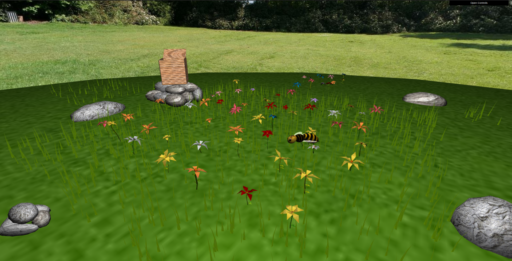

# Computer Graphics Project

## Description
This project consists of a scene composed of a meadow made of grass - that has a wind effect - and flowers. To make the scene more realistic, it is supposed to have rocks and some rock sets. 

There is a bee that flies around the scene and lands on the flowers to collect pollen. That be can be controlled by the user, who can make it catcc the pollen and return to the hive.

## Observations

- All the required mandatory features were implemented.

- Everything was done according to the project's specification, meaning that there is no extra explanation needed.

- Some details that may value the project were added, such as:
    1) There is a maximum speed for the bee, so that it doesn't increase its speed infinitely.
    2) Creation of a matrix to draw polens in the hive when they are delivered by the bee.
    3) Pressing the 'F' key will make the bee to find the nearest flower and descend there in a parabolic trajectory.
    4) Different textures for rocks, petals, stem, etc were used to improve that random aspect of the scene.
    5) Each flower has two layers of petals, making it more realistic.
    6) The bee stops the wings to rest when it is in a flower.

## Final Scene Appearance

## Authors
- Luís Jesus (up202108683)
- Miguel Rocha (up202108720)

Class T03 - Group 04