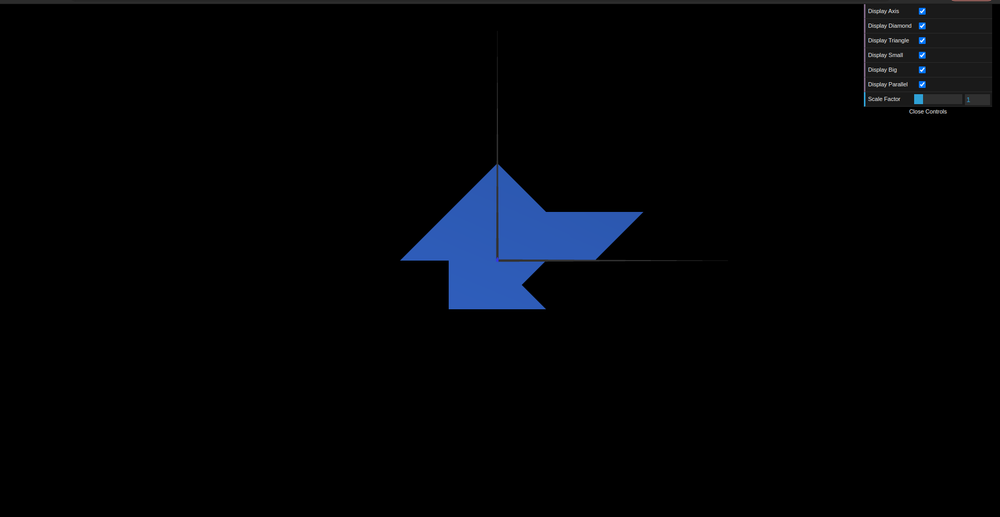

# CG 2023/2024

## Group T03G04

## TP1 Notes

- In Exercise 1, we created three new subclasses of CGFobject: `MyTriangle`, `M̀yDiamond` and `MyParallelogram`. These classes represent different geometric shapes that we can render in our scene. We learned how to define the vertices and indices for each shape, and how to use these definitions to create the actual geometry in WebGL. We also learned how to make a shape double-sided by repeating the vertices in clockwise order, which ensures that both sides of the shape are visible when rendered.

- In Exercise 2, we created two additional subclasses of CGFobject: `MyTriangleBig` and `MyTriangleSmall`. These classes represent larger and smaller versions of the MyTriangle shape we created in Exercise 1. 

- Overall, these exercises helped us understand the basics of creating and rendering geometric shapes in WebGL, as well as how to manipulate their appearance and visibility in our scene.

