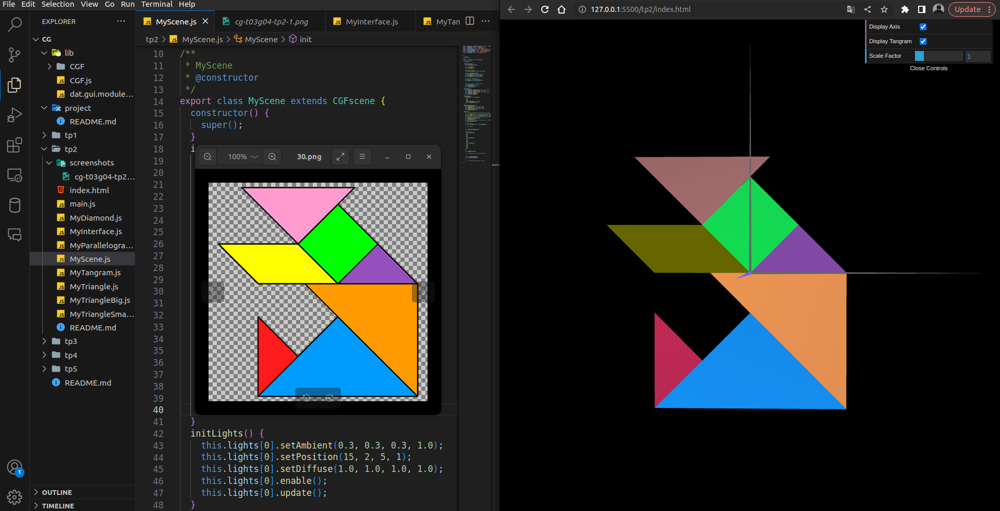

# CG 2023/2024

## Group T03G04

## TP2 Notes

- Tangram Construction: We pieced together a `Tangram figure`, aligning it around the origin. This exercise improved our skills in manipulating objects in space using `transformation matrices`.

- Through the use of `pushMatrix()` and `popMatrix()`, we `dynamically` positioned our Tangram components, showcasing the flexibility in managing complex scenes.

- Cube Creation: We built a `unit cube` centered at the origin,  defining each vertex to transition from 2D to 3D modeling. 

- Integration with Tangram: By placing the cube `behind` the Tangram as a base and meticulously applying geometric transformations, we effectively `merged` 2D and 3D objects in a three-dimensional space.

- Cube from MyQuad: Instead of defining `each vertex` for the cube, we crafted a new cube by `repeatedly` drawing a `single unit square (MyQuad)`. This approach highlighted the `efficiency` of using geometric transformations to create complex 3D objects from a single 2D shape.

