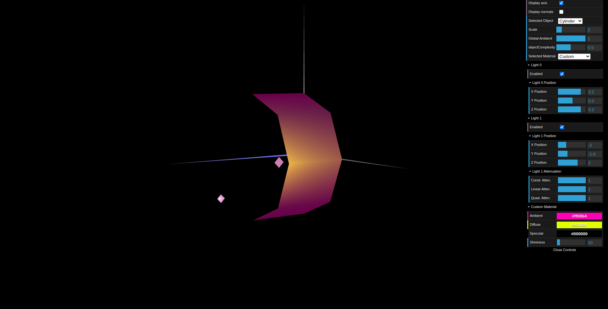

# CG 2023/2024

## Group T03G04

## TP3 Notes

- In the first part, using the figures created in the previous practical classes, we established all the necessary `normals` so that the calculated lighting would make sense in relation to the angle of light incidence and the viewing angle (`diffuse` and `specular` components).

- We created a material with a color similar to wood. To acheive that, we used a `low specular` component.

- We also created and applied various `materials` with a high `specular` component to the figures in the `tangram`.

- In the second part, we constructed a `prism` with a `variable` number of `sides` and `slices`.  

- We had to implement an algorithm to create vertices and generate normalized normals at each vertex. 

- `Constant shading` computes lighting based on a single normal vector per face, assuming flat surfaces that reflect light uniformly. Since all vertices of a face share the same normal vector, the lighting across that face `appears uniform`, `mimicking` the effect of constant shading. 

- In the final part, we `reduced` the number of `vertices` and normals to be calculated and made the normals `perpendicular` to each edge.

- We could verify that it `smoothed` the lighting transitions at the edges, giving the surface of the previous prism a `curved appearance`.

