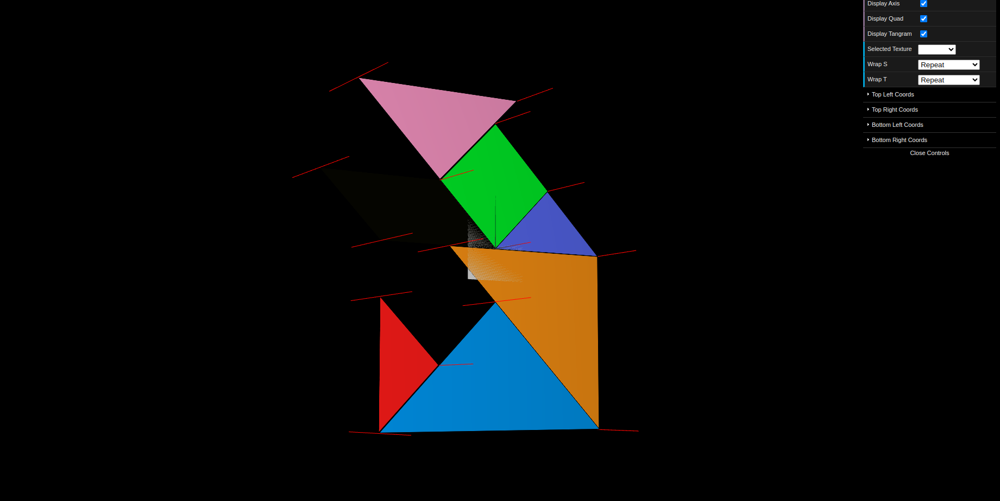
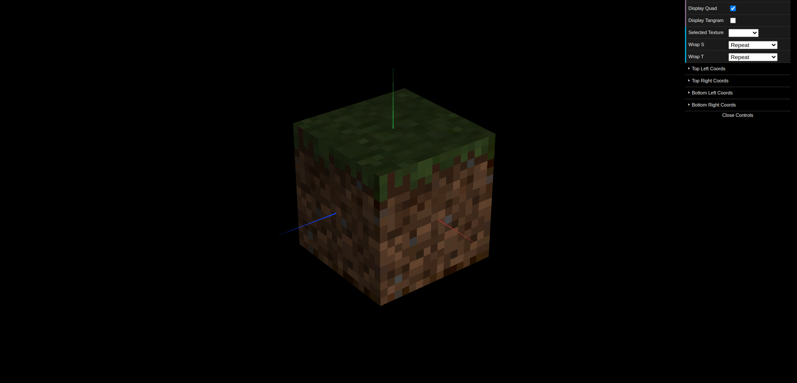

# CG 2023/2024

## Group T03G04

## TP4 Notes

In exercise 1, we mapped the given texture `tangram.png` in each of the tangram pieces. It was initially difficult to understand what texture coordinates to use, but after some trial and error, we managed to map the texture correctly and understand how the texture coordinates work.

The second exercise involved mapping the minecraft block texture to MyUnitCubeQuad in each of its faces (squares). Since the texture size was less than the size of the squares it got blurred, since there is a linear interpolation of the colors. Changing the texture filtering to `GL_NEAREST` solved the problem.

