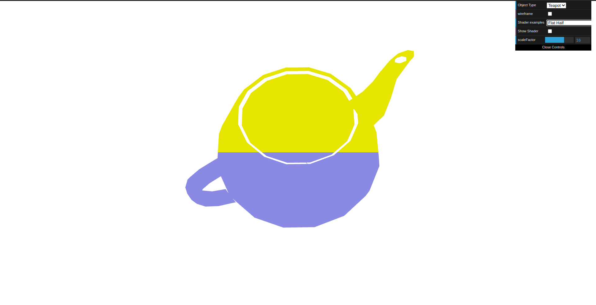
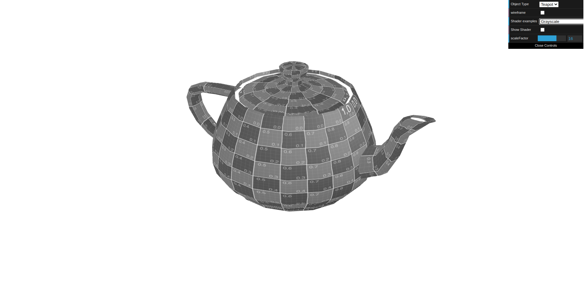
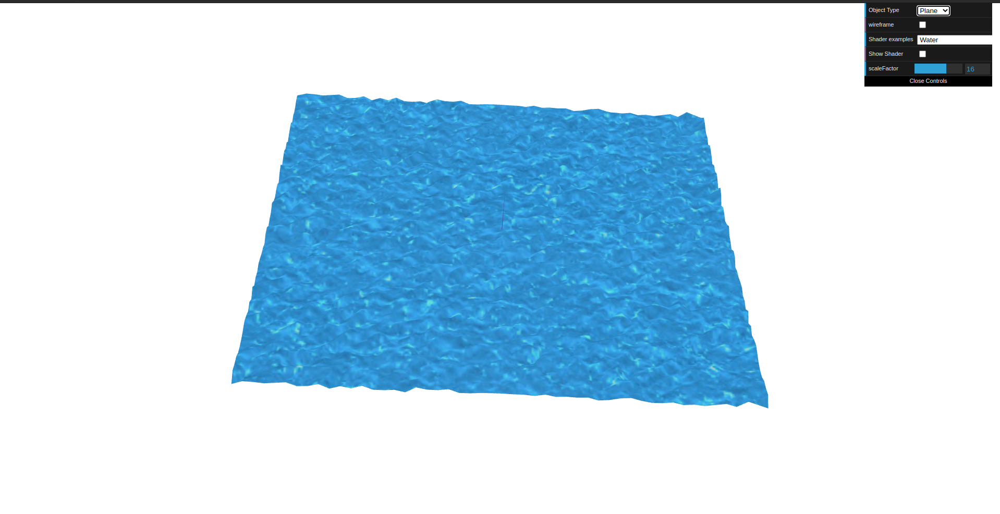

# CG 2023/2024

## Group T03G04

## TP5 Notes

- In the first part of Exercise 1, we created new vertex and fragment shaders aimed at changing the color of a teapot based on the fragment's position in the window. 

- We utilized the information of the vertices' position after transformation, stored in `gl_Position`, to decide the color of each fragment. By creating a `varying` variable in the vertex shader, we passed the vertex position to the fragment shader. 

- Depending on the `y` coordinate of this position, the teapot is colored yellow in the upper half of the window and blue in the lower half:

- In the second part of Exercise 1, we introduced movement along the XX axis following a sinusoidal wave. Subsequently, the teapot was rendered in a grayscale color based on sepia tones:

- In Exercise 2, we applied `water texture` with `shaders` on the plane. 

- The texture coordinates were animated over time, and the vertices were adjusted according to the color components of the texture

